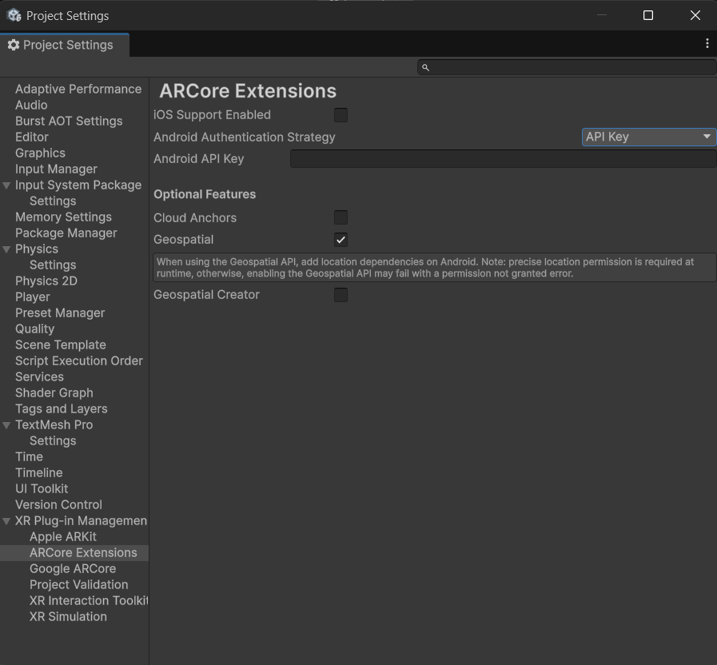

# meARy: AR 기술을 활용한 소셜 네트워킹 서비스

---

### 1. 프로젝트 배경
#### 1.1. 국내외 시장 현황 및 문제점
21세기 정보통신 기술의 발전과 스마트폰의 보편화는 소셜 네트워킹 서비스(SNS)의 폭발적인 성장을 이끌었습니다.  
페이스북, 인스타그램 등은 핵심적인 소통 채널로 자리 잡았으나, 여전히 텍스트, 사진, 동영상 등 2차원 미디어 중심으로만 제공되어 사용자의 경험을 제한합니다.  

#### 1.2. 필요성과 기대효과
본 프로젝트는 이러한 한계를 넘어, 기존 SNS 경험을 3차원 공간으로 확장하여 새로운 소셜 네트워킹 경험을 제공합니다.  
- 사진 한 장으로 사용자의 3D 모델 생성 및 AR 배치 가능
- 기록을 단순히 보는 것이 아니라, 직접 방문·상호작용하며 공유 가능 
- 몰입감과 유대감 증진, 새로운 추억 공유 방식 제시  

---

### 2. 개발 목표
#### 2.1. 목표 및 세부 내용
최종 목표:  
사용자가 생성한 영상 콘텐츠를 기반으로 사용자를 닮은 3D Model을 생성하고,  
이를 AR 환경에 재현하여 몰입적 상호작용이 가능한 소셜 네트워킹 서비스를 개발하는 것.  

주요 기능:  
- **AR 포스팅 업로드**: 인물 인식 → 사진 촬영 → 지구계 좌표 추출 → 3D 모델 포즈 리타겟팅 → 서버 저장 (포즈 리타게팅 된 3D 모델, Google Geospatial Position)  
- **AR 포스팅 조회**: 특정 위치 방문 → Flask 서버 요청 → 3D 모델 로드 및 AR Anchor 배치 → AR Anchor에 3D 모델 적용 

#### 2.2. 기존 서비스 대비 차별성
- 기존 서비스: 2D 기반 콘텐츠 소비 
- 본 프로젝트:  
  - 사진 한 장으로 개인화된 3D 모델 생성  
  - 포스팅 사진을 기반으로 3D 모델에 포즈 리타게팅
  - 포스팅 위치를 기반으로 포즈 리타게팅 된 3D 모델을 AR 환경에 배치 

#### 2.3. 사회적 가치 도입 계획
- 디지털 기록을 물리적 공간에 남기는 새로운 소통 패러다임
- 장소에 의미를 부여하고, 사용자 간 유대감 증진  
- 디지털 상호작용을 현실로 확장 → 지속 가능한 소셜 경험 창출  

---

### 3. 시스템 설계
#### 3.1. 시스템 구성도
- **클라이언트 (Unity AR Foundation + Google ARCore Extensions)**: AR 포스팅 업로드 및 조회  
- **백엔드 (Flask 서버, Ubuntu)**: API 처리 및 DB 관리  
- **3D 파이프라인 (Blender)**: 포즈 리타게팅 처리  
- **데이터베이스 및 스토리지**: SQLite, 로컬 저장소(GLB)  
- **외부 API**: Google ARCore Geospatial API  


#### 3.2. 사용 기술
- **클라이언트**: Unity AR Foundation, Google ARCore Extensions, MediaPipe Unity Plugin (C#)  
- **백엔드**: Flask, SQLite, ngrok  
- **3D 모델링**: tripo3D, Adobe Mixamo, Blender, MediaPipe BlazePose (Python Library) 

---

### 4. 개발 결과
#### 4.1. 전체 시스템 흐름도
- **AR 포스팅 업로드**  
  1. 인물 감지 (Mediapipe BlazePose (C#))
  2. 인물 감지가 완료되면 사진 촬영
  3. 인물의 위치 좌표 추출 및 변환 (AR world 좌표 → 지구계 좌표 변환)  
  4. 서버 전송 → 포즈 추출 및 3D 모델 리타겟팅 (Mediapipe BlazePose (Python) → blender pose retargeting pipeline)
  5. 결과물(.GLB) 저장 

- **AR 포스팅 조회**  
  1. 사용자 위치 확인 (Google ARCore Geospatial API)  
  2. 서버에서 가까운 포스팅 응답 (GLB, 좌표)  
  3. AR Anchor 위에 모델 배치  

#### 4.2. 기능 설명 및 주요 기능 명세서
- **Human Detection (Unity, MediaPipe Plugin)**: 사진 속 인물 감지  
- **Pose Retargeting (Blender)**: 33개 포즈 랜드마크 → 모델 스켈레톤 정렬  
- **AR 모델 배치 보정**: GPS 고도 오차를 AR Plane Detection 기반으로 보정  

#### 4.3. 디렉토리 구조
```
meARy/
├── backend/
│ ├── app/ # Flask 서버
│ ├── db_init.py # db 생성 스크립트
│ ├── requirements.txt # 필요 library
│ └── run.py # 서버 실행 스크립트
├── unity/
│ ├── Assets/
│ │ ├── meARy/ 
| | | ├── Scripts/ # Unity AR 애플리케이션 핵심 구현 파트 
│ │ | └── UI/ # AR 애플리케이션의 UI 구성에 사용된 리소스
| | └── ...
│ └── ...
└── README.md
```
#### 4.4. 산업체 멘토링 의견 및 반영 사항
- 자문 의견: 360도 영상을 통한 3D 모델링은 품질,환경,장비 의존도가 높아 구현 안정성이 떨어지며
허들이 있다고 생각하여, SMPL 방향 검토 의견을 전달드렸습니다.(상대적 쉬운 대안 검토
요청) 다만, 중간보고서에도 잘 나와 있지만, PARE/SMPL 은 GPU의존도와 입력데이터
품질 제약이 있어 이를 어떻게 해결할지 고민이 필요합니다
- 반영 방안: 2D 이미지 기반 3D 모델 원본을 생성하고 mediapipe pose detection을 기반으로 추출한 자세 정보를 원본에 리타게팅하는 방안으로 GPU 사용 필요를 없앴다.

---

### 5. 설치 및 실행 방법
>
#### 5.1. 설치절차 및 실행 방법
- 백엔드 서버 실행(at Ubuntu 22.04, Python 3.10, Blender 4.4.3)
   ```commandline
   # 처음 한 번만 생성
   python -m venv .venv

   # 가상환경 활성화 for Windows
   source ./.venv/bin/activate

   # mediapipe 설치# mediapipe 설치
   pip install mediapipe==0.10.21

   # 주요 라이브러리 설치
   pip install -r requirements.txt

   # 서버 실행
   python run.py
   ```
- Unity 앱 설정
   1. Google ARCore Extensions API Key 설정
      - Unity Editor → Project Settings → API Key 입력
      

   2. Google ARCore Extensions ARF6 Package 설정
      - https://github.com/google-ar/arcore-unity-extensions/tree/arf6
      - git hub repository에서 .zip 파일로 다운로드
      - Unity 프로젝트의 Packages 폴더 안에 "com.google.ar.core.arfoundation.extensions" 이름으로 Package embed
   3. MediaPipe Unity Plugin (C#) Package 설정
      - https://github.com/homuler/MediaPipeUnityPlugin
      - git hub repository에서 .zip 파일로 다운로드
      - Unity 프로젝트의 Packages 폴더 안에 "com.github.homuler.mediapipes" 이름으로 Package embed

### 6. 소개 자료 및 시연 영상
#### 6.1. 프로젝트 소개 자료
- [프로젝트 최종 보고서 (PDF)](docs/01.보고서/2025전기_최종보고서_07_meARy(메아리)_AR%20기술을%20활용한%20소셜%20네트워킹%20서비스%20개발.pdf)
- [발표 자료 (PPT)](docs/03.발표자료/2025전기_발표자료_07_meARy(메아리).pdf)

#### 6.2. 시연 영상
- [시연 영상 링크](https://www.youtube.com/watch?v=6Jr0kbTqL4k)
- 주요 장면: 사진 촬영 화면, 모델 배치 화면

---

### 7. 팀 구성
#### 7.1. 팀원별 소개 및 역할 분담
| 이름   | 역할 |
|--------|-------------------------------|
| 김진영 | Unity AR Foundation, Google ARCore Extensions 기반 AR 기능 및 안드로이드 앱 개발 |
| 임석윤 | Unity AR Foundation, Google ARCore Extensions 기반 AR 기능 개발, 백엔드 개발 |
| 허취원 | 3D 모델 생성 및 Blender 기반 Pose Retargeting Pipeline 개발 |

#### 7.2. 팀원 별 참여 후기
- 김진영: 익숙한 웹 서비스가 아닌 전혀 새로운 AR 애플리케이션 서비스 개발을 배우고 경험한 것이 매우 가치있게 느껴졌습니다. 또한 생애 첫 Unity AR 앱 개발을 시도하면서 많은 시행착오가 있었지만, 팀원들과 함께 헤쳐 나가는 과정이 유의미한 경험이었습니다.
- 임석윤: 6년 간 학교를 같이 다닌 학우와 팀을 이루고 약 6개월 간 협업한 이번 경험을 잊지 못할 것 같습니다.
- 허취원: 혼자 수행할 수 없는 양의 프로젝트를 학우들과 소통하며 진행하니 만족스러운 결과물을 만들 수 있었습니다. 

---

### 8. 참고 문헌 및 출처
1. V. Bazarevsky, I. Grishchenko, K. Raveendran, T. Zhu, F. Zhang, and M. Grundmann,  
   *BlazePose: On-device Real-time Body Pose Tracking,* arXiv preprint arXiv:2006.10204, Jun. 2020.  

2. Google Research. (2020, Aug 13). *On-Device, Real-time Body Tracking with MediaPipe BlazePose.*  
   [https://research.google/blog/on-device-real-time-body-pose-tracking-with-mediapipe-blazepose](https://research.google/blog/on-device-real-time-body-pose-tracking-with-mediapipe-blazepose)  

3. Unity Technologies. *AR Foundation Manual*  
   [https://docs.unity3d.com/Packages/com.unity.xr.arfoundation@6.1/manual/index.html](https://docs.unity3d.com/Packages/com.unity.xr.arfoundation@6.1/manual/index.html)  

4. Google ARCore. *ARCore Extensions for AR Foundation*  
   [https://developers.google.com/ar/develop](https://developers.google.com/ar/develop)  

---

### 9. Third Party Plugin
본 프로젝트는 [MediaPipe Unity Plugin](https://github.com/homuler/MediaPipeUnityPlugin)을 사용합니다.  
자세한 라이선스 및 저작권 고지는 [THIRD_PARTY_LICENSES.txt](THIRD_PARTY_LICENSES.txt)에서 확인할 수 있습니다.